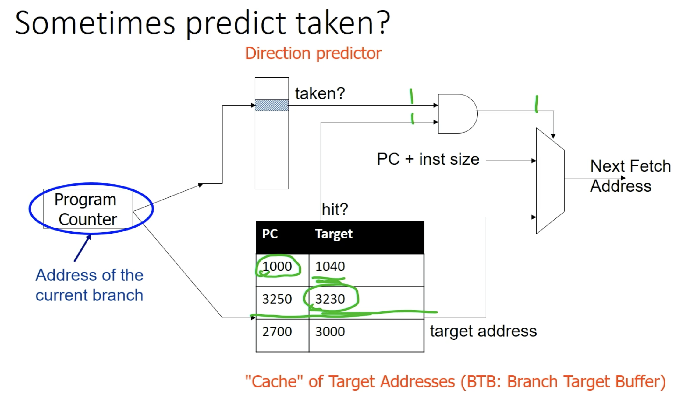

# Note Part2: Digital Logic

[TOC]

## Lec 8 (1): 表示 float nums

digital logic 前的最后一个主题：如何表示 float numbers

float number 的表示方法是使用 IEEE floating point format，和 2's complement 完全不同.

single precision 单精度 (float in c++)：
32位数字，其中 

1. Most significant 是第 31 位表示正负：0 表示正，1 表示 负

2. **exponent**: 第 23-30 这 8 位是一个 exponential 数字，表示这个数字乘以二的多少次方。它**以 -127 为偏移量**，也就是说这八位数字从 0-255 的范围，可以表示从 -127 到 128. 所以它的范围是 $2^{-127}$ 到 $2^{128}$ 次方。所以可以表示很接近 0 到很大的数

   比如 `10000101` 就是 133，于是 exponential = 133-127 = 6，

3. **Mantissa**: 第 22 到 0 个 Bits 是 23 个有效数字. 它代表 1 后面的小数部分（隐含了最前面的一个 1， 所以其实是 24 位有效数字）

   $M$ 可以表示 $2^{-23}$ 到 $1 - 2^{-24}$ 的 $(0,1)$ 之间的精度.

所以最后的结果是 $\pm 1.M \times 2^{exp}$ .

并且我们发现其实 **exponential 就代表了把小数点后移多少位。**

起始的地方在 1.0，第零位是 $2^0 = 1$，第一位是 $2^-1$，第二位是 $2^{-2}$，。。。如果 exponential = 133-127 = 6，那么第一位就变成了 $2^{0+6} = 2^6$，第一位变成了 $2^5$

我们不难发现一件事情就是：当 exponential 变大的时候，我们能表示的两个数之间的间隔就变大了，精度就变小了。比如当 exponential = 23 的时候，我们就无法精确表示小数了；当 exponent > 23 的时候，我们甚至无法表示一些整数了。

双精度浮点数 (double in C++) 有 64 位，其中有 53 bits of precision。所以它在 exp > 53 时也会无法表示整数

也就是说如果我们 declare `double x = pow(2, 55) + 0.23332131;`，我们并无法得到我们想要的数而是被迫只留下 $2^{53}$...... 即便使用 long double，还是有同样的问题

解决办法是我们自己写一个数据结构，通过算法来实现无限大精度。（其实不需要，因为现在有很多这样的 library 比如 GMP 等）

## Lec 8 (2): Combinatorial Logic

一些小 trick:

XOR = not (A nor (A nor B) nor (B nor (A nor B)))

not(A) = nor(A, A) = nand(A, A)

### Mux(multiplexor)

Mux: S = 0 时选择 A(上) 的值，S = 1 时选择 B(下) 的值

mux 和 nor, nand 一样都是 universal 的！一个 2^N entry 的全 truth table 可以通过 N

**mux: S ? B : A**

即 **(A and notS) or (B and S)**

我们可以通过嵌套 mux 来达成多个 Input 的 mux.

(programmable hardware)

### Decoder

一个 decoder 获取一个 n-bit binary 作为 input，并且 output $2^n$ 个 Bits. 其中有且仅有一个 bit 是 1，其他都是 0

比如一个 3x8 的 decoder，获取一个 3 位的 binary 作为 Input，这个 binary 的范围是 0-7 (0-indexed)，于是我们的 8 位输出中对应这个数字大小的一位是 1，其他是 0.

ex: 0b101 = 5，所以 decoder 的第六位 (b5) 是 1.

### Adder

#### half-adder

half-adder 不考虑先前的进位，是一个简化的计算一个 bit 和一个 bit 相加的工具。我们获取两个 bits，算它们相加后这一位的结果和是否有进位 （一共也就 0, 1, 2）

#### full-adder

我们可以增加一个 Input：上一位的 carry bit，这样就可以得到一个 full adder.

通过连接 n 个 full adder，我们可以得到一个 n-bit adder

#### 从 n-adder 得到 n-substracter

我们知道 A - B = A + (-B)，

并且 2'complement 下，-B = ~B + 1

于是我们发现了一件巧妙的事情：一般情况下，我们把第 0 个 bit 的 input carry bit 设置为 0；而**我们只需要把这个第 0 位 carry bit 设置为 1，然后 invert B，就可以得到 A - B**

我们可以在 B 上加一个 mux，这样就可以通过控制是否 flip B 来控制这个 adder 和 subtracter 之间的转化，让其多功能。

### ALU design

我们需要一个计算单元把 full adder 和 nor 结合起来，这样它就可以用来做到任何的基础运算。

ALU 就是  Arithmetic Logic Unit。我们很自然想到把一个 32-bit full adder 和一个 32 位 input 的复合 nor gate 的输出用一个 mux 连接起来就可以实现一个 ALU.

(这只是对于 LC2K，其他更复杂的 processor 融合了更多函数)

当 S = 1 时这是个 nor，当 S = 0 时这是个 32-bit adder. 

## Propagation delay

当 gate 的 input 变化时，output 不是立刻变化的。gate 的处理需要一定时间。因为 speed of light 也是有限的，transmit through wires 需要一定时间；并且电压变化也不是一瞬间的，电压变化到一定值使得 transistor switch 也需要一定时间。

所以有了 Propagation delay. 也就是对于每个逻辑门（可以忽略 wires 的电速传输导致的 delay），我们都要考虑它接受 Input 到输出 output 之间，逻辑门处理的 delay.

**overall delay 就是 delay 最大的一个串联路线的 delay.** 

我们需要考虑 delay，因为我们需要保证我们留下了充足的时间让它 propagate，以至于我们得到的值确实是逻辑结果而不是误差导致的中间结果

## Lec 9: Sequantial Logic

Combinatorial Logic 指的就是 circuits whose input 只取决于 current input. 即不关心时间，只需要 operands 就能产生结果

但是 combinatorial logic 并不能形成一个 computer. computer 会 remember previous inputs 并根据 history 对相同的 inputs 有不同的表现。

具体的理解是：

我们的 program 有 state. states 就是当前程序的状态：比如各个变量的值，PC 在哪一条指令上，regs 的内容以及 memory 上的内容等等。

而 input 则是外部的数据输入：比如 cin 等等

对于不同的指令，以及变量值得不同，计算机处理相同的输入内容的行为不同。

我们可以用 gates 来建立 seq logic. 关键在于 feedback: 一个 gate 的 output 会 fed back into its own inputs.

一个这样的 cell 会记住初始值，一直停留在初始值上。但是我们无法再改变它。所以我们需要一些输入来控制一个单元，让它能够变成这个 cell，但是也可以控制它变化。

### SR latch

latch 即一个触发器

SR 用来 implement memory，表示要不要把一个 bit 设成 0/1

S, R 是两个 bit input。S 代表 set，R 代表 reset

S = 0, R = 0：什么都不做，Q 保持原先状态（本来是1就是1，本来是0就是0），因为这个时候被转化成了这个稳定的

S = 1, R = 0 (set)：输出 Q = 1（Q reverse = 0）

S = 0, R = 1(reset)：输出  Q= 0（Q reverse = 1）

S, R = 1: undefined behavior. 这个时候输出 Q 和 Q^ 都变成了 0，暂时稳定，但是问题是：**如果我们这个时候调整 S, R 都变成 0，那么 Q 和 Q^ 都会不停 rapidly osilating between 0 and 1**，circuit unstable 且不可预测.

### D latch (improved SR latch)

D 表示 Data

G 表示 Gate.

这个改进版本的好处就是不会再出现 undefined behavior，保证了数据安全。

**现在设置 G = 1：允许改写 data，Q = D。我们称这个状态下 latch 是 transparent 的（允许修改**

**设置 G = 0：不允许改写 data，不论 D 是多少，Q 都保持原状**

#### 画 D-latch Timing Diagram

在刚开始的时间：G low，Q 保持之前的状态（不知道），所以画两条线表示 Uncertainty.

之后，我们的原则：只有 G 开时改写，G 关上时保持状态。

### D flip flop (improved D latch)

D latch 的 problem: G 必须被 set very precisely

我们可以尝试用 32 个 D latches 来储存 PC，并且通过这样的循环，每次当 ready to 执行下一个 instruction 的时候就 open gate 来控制 PC++

但是问题是这个电路太过敏感。我们需要 PC 恰好被 ++ 一次（或者特定数量）

如果 G 设置的时间过长了那么信号可能会 propagate round 两次以至于 PC 被 increment twice；如果 G 设置的时间过短可能 latch 没有 stabilize，使得 PC 没来得及 imcrement

（FYI: set 一个 frequency 很高的 signal 是很难的）

所以 timing 很难。

所以我们添加一个 clock：一个在 0 和 1 之间 alternating 的固定 frequency 的 signal.

只在 clock 的 edge 上 write data.

this class 只考虑在 rising edge 上写入 data 的固定的 Clock 接入方式. (Dually)

就是这样的接入方式。我们可以验证它只在 clock 从 0 变成 1 的 rising edge 上使得数据被写入 Q（可以但没必要

D flip flop 并不是无懈可击的，如果恰好，data 改写的时间就在 clock 的 rising edge 上，那就 bad. (reason: will know it if you take 270)

标识：普通 D latch，D flip-flop 和 Enabled D Flip-Flop （多加入 enable 信号，只有 enabled 时才会接收更改，

#### 为什么 Flip Flop 可以避免PC被 increase 多次的问题

假设 PC 在一个时钟周期内需要递增一次，而在时钟高电平期间，递增信号传递到 D Latch。由于 D Latch 在高电平期间对输入开放，如果递增信号持续存在，PC 可能被递增多次，因为每次输入 D 变化时都会更新输出 Q。

当使用 D Flip-Flop 来存储 PC 时，即使 PC 的递增信号在时钟周期的高电平持续时间内保持有效，D Flip-Flop 只会在时钟的边沿时刻更新 PC 的值。因此，即使递增信号在时钟高电平期间存在很长时间，PC 也只会被递增一次。

（my question: 如果同一个 pc 递增信号经历了两个 clock edge 怎么办？如果一个 pc 递增信号在 clock edge 来到之前就消失怎么办？

答：不考虑。假设一个信号一定正好经历一次 clock edge.

## Lec 10: Finite State Machine

combinatorial logic：用来 implement 布尔表达式

sequential logic: 用来存储状态

现在我们学习如何

一个 FSM 的组成是

1. 有限个状态
2. N 个 inputs
3. M 个 outputs
4. Transition function $T(S,I): states \times inputs\rightarrow states$，把每个状态下的每个 input 都映射到一个新的状态
5. Output function: 分为两种：如果只取决于 State，那么就是 Moore Machine；如果取决于 state 和 input，那么就是 Mealy Machine

计算机中的 一个state 就是 memory, reg files 和 regs 的值. 我们使用 Read Only Memory 来 implement （对于一个ISA的）transition function：即操作指令如何和 memory 进行交互

和 376 的 FSA 基本一样。区别是：FSA 只在 final state 产生 output 而 FSM 一直在产生 output；FSA will eventually stop，但是 FSM 会有不停的 (ideally) input，不会 stop.

FSM 就是一个每时每刻都接受 input，并马上通过 input 来到 next state 并产生 output 的机器。

### ROM(read only memory)

我们使用 programmable read only memory （每个 bit 只能修改第一次）针对我们的 ISA 来 implement 出它的 FSM（即读写数据以及计算数据的 data path）

Idea: 由于有很多变量和输出结果不同，我们用 logic gates 来实现真值表太过于耗时间。

所以我们考虑直接把整个真值表储存进某个 Read Only memory 里。可以直接买一个 read only memory bar 来实现。

ROM 的使用是这样的：

这是一个 8 entry 4 bit 的 ROM.

我们输入一个 3 位的 bits 用 3x8 decoder 把它的输出转化为 8 位只有一位是 1 的 bits，于是每一个输入就对应了 decoder 的一个 horizontal line.

我们可以通过调整 data output 和 horizontal line 交线上的 diodes 来编辑 ROM（只能编一次，因为调整就是把它烧掉），控制这一条 horizontal line 对应的输出。

这就实现了每个 state 的不同输出

这种存储 state output 的方式很常见，也有缺点：如果我们要多加入一个 bit 的 input，我们就要 double the size of ROM. 所以储存大小的需求是 exponential 的

#### 计算 size of ROM

Size of ROM = #of ROM entries * size of each entry. 	

其中 #size of ROm entries = $2^\text{input size}$， size of each entry = outputsize

所以
$$ { }
\text{sizeROM} = 2^{input size} * \text{outputsize}
$$
对于 24 位地址的输入，假设我们 ROM memory 宽度是 13 bit，那么我们需要 2^24 * 13 =218,103,808 bits = 26 MB ROM. 如果我们买 六美元 4mb 的 ROM，我们需要大改 42 美元才可以实现

（并且我们需要编辑这些 ROM，显然不太可行

所以我们需要结合 combinatorial logic 和 ROM 来实现 transition 来优化我们需要的 ROM 大小

ex：

优化前：ROM = 2^24 * 13 bits

优化后：ROM = 2^5 * 4 bits

## Lec 11: Single-Cycle Datapath

我们需要设计一个 General purpose processor. 

它需要做的：

1. fetch instructions 

2. decode instructions (即把 instructions 输入给 control ROM)

3. 通过 ROM 来控制 data movement

   包括 pc++，reading regs，ALU control 等

   LC2K 中，ROM 接受一个 3x8 decoder，把 3 位的 opcode decode 为 00000001 - 10000000，对应八个不同的八个 bits. ，放在合适的地方（比如作为某个 mux 的选择 bit 等）来实现不同的操作

4. 用 clock 来 drive all

Note: 我们 assume 任何 memory 都是一个 array of D flip flops，实际情况更复杂，但是我们这样假设

Note2: sign extension 运算

### State Building Blocks: reg files, memory 

Reg file 就是所有 regs 的集合。

我们使用这样的一个 reg file memory block 来储存 memory，通过逻辑门取其中的第 R1 个和第 R2 个以及第 D 个：R1，R2 表示读取的两个 regs，D 表示要写入的 reg

W 表示要写入的数据

还有组合进它的逻辑的是一个 enable bit，用 mux 来控制是否要打开 write. 不需要改写 reg value 的指令可以不 enable 它，使得速度更快

data memory：更慢的 memory。这是因为我们总是先处理 reg file，然后 reg file 中输出的 reg values 再才可能输入到 data memory 里，用以交互，储存 regs 里放不下的值

同样支持读写，需要一个 enable bit 和一个 mux 控制 enable

现在我们做一个 single-cycle datapath for LC2K: **任意 instruction 都在一个 clock cycle 内完成**

### Overall View

### ADD/NOR

add regA, regB, destR

即：dest R = regA + regB; PC++

opcode: 000，decode: 00000000

1. 第 6 个 ROM bit: mux 设置为 1，因为 regA 是 bit 2-0
2. 第 4 个 ROM bit: reg write enable 设置为 1，因为要改写 destR
3. 第 3 个 ROM bit: mux 设置为 1，因为我们需要获取 regfile 的第二个 output 而不是上面 sign extend 的 offsetfield 的值
4. 第 2 个 ROM bit: ALU 设置为 0，因为我们需要 add 而不是 nor
5. 第 5 个 ROM bit: MUX 设置为 1，因为我们要的不是 data memory write 回 reg files，而是要这个时候我们的 reg1+reg2 的结果 write 回 destR.
6. 第 1 个 ROM bit: enable 设置为0，因为不需要写入 data memory.
7. 第 0 个 ROM bit: 随便，因为已经设置 enable 0 了，这个时候 R/W 都不生效

用时：读指令（access memory）+ read reg + ALU + write reg

nor: 除了第 2 个 ROM bit 设置为 1，获取 Nor 结果，其他都一样。

### LW/SW

lw regA, regB, offset，即：

regB = M[regA + offset]; PC++

write enabled. reg1 在 ALU 中和第三个 mux 里来的 sign extend offset 进行相加，结果进入 data 作为 read memory 的位置，把 read 出来的 memory 又传输给了第二个 mux，于是第一个 mux 代表的  reg 的值被改写为第二个 mux 的 output 的值

这里 R/W 的 0 表示 R，read.

sw: 即 M[regA + offset] = regB; PC++

#### 耗时

sw: get inst(read mem) + read reg + ALU + read mem

lw:  get inst(read mem) + read reg + ALU + read mem + write reg

### BEQ

beq regA, regB, offset

if (regA == regB) 则 PC += 1+offset

else PC++

对于 beq，我们需要另一个额外的通路。设置一个四 bits 的 and，b3 获取 ALU 的结果看是否是1，b[2:0] 判断 opcode 是否是 beq(100).

我们在 ALU 中判断 regA 是否等于 regB 的方法即：not(XOR(A,B)) = (A nor (A nor B)) or (B nor (A nor B))

#### 耗时

read inst(mem)  + read reg + ALU

### JALR

jalr: jump and link register

即：

write PC+1 into regB

regA = PC

这是一个 Ugly instruction。。。

jalr 也需要额外的通路。

1. pc+1 的结果要通到第二个 mux（图中蓝色），并且要新加一个 seletion bit，选择 01 作为二位的 selection bits（pc+1 通到中间

2. register file 的输出要通到第0 个 mux（图中粉色），也是一样需要两个 control bits（因为一共有三个 inputs，其实还有隐形的第四个但总是0）

   **这两个 control Bits = 01（正确的 control bit）当且仅当 opcode = 101 (jalr) 并且 regA 不等于 reg B。我们需要加一个判断并通到第二个 control bit 的控制 AND 门的最高位上，用一个 not equal 的判断逻辑门。**

   这是因为：我们难以处理 regA = regB 的状态。这个时候我们做的事情等于存 Pc 以及 pc++.

   但是问题是：我们 update PC 和 reg file 是在同一时刻的。会导致我们把旧的 PC（没有++）更新到 PC 上。所以我们需要判断 regA 不等于 regB。

Halt：更加复杂。我们实际上并不能真的停止运行，只能 transfer control over 其他的 running programs. 这里不 implement.

## Lec 12 Multi-Cycle Datapath & Pipelining

对于 single-cycle 而言，所有 Instructions 都 run at the speed of the slowest instruction. **(最慢的指令决定 clock 周期，这是为了统一 clock 的周期，让最慢的指令也可以在一个 clock 内运行完)**

如果我们想添加一个 long instruction，那么整体性能将极大下降；即便我们可以优化很多模块，也完全没用。

并且我们并不能 reuse processor 的任何 part

比如如果最长的指令是 lw，8ns

有一百条指令，single cycle 运行延迟就是 800ns

我们希望每个指令有各自的运行延迟

### Multi-Cycle Execution Overview

每个 instruction 都 take multiple cycles

cycle time reduced

Slower instructions take more cycles，faster instructions take fewer cycles

这样我们就可以通过优化一个操作来优化一个 clock cycle，从而让全部运行时间都降低，而不受短板的限制。并且我们每个 cycle 可以 reuse datapath.

为了完成这个优化，我们需要：

1. 更多，更 wider 的 MUXes， 为了 **reuse elements for different purposes.**
2. 更多 regs 用来记住同一个指令的上一个 cycle 的 output
3. 更复杂的 control

做法有很多种，我们可以选择: 把一个 instruction 分成好几个 discrete 阶段

cycle 1: fetch instruction from memory

cycle 2: decode instruction

cycle 3+: 执行 instruction

Multicycle datapath 的 idea 就是：用更多的 control 换取单次 cycle 更短的时间，通过多次的 cycle 来实现一个指令

**我们发现：ROM 的宽度，即一个 state 的  output，应当有 12 个 bits，如上图（MUXalu2 是 4-mux，有两个 bits)**

**一共 13 个 state，所以需要 4 个 Bits 来 encode state**

（为什么 lw 要分成三个 states ? 因为我们希望宁愿多一个 state 也不要 clock cycle 时间变长，不然所有 Instructions 的ns都变长了）

**所以 ROM 的大小是 $2^4 \times 12$**

### State 0 (Universal): fetch

1. 设置 PC_en 位 0，因为我们这个时候还不想 update PC
2. 设置 MUX_address 为 0，因为我们想要 PC 的 input 而不是结尾 ALU 返回回来的 Input
3. 设置 memory enabled 为 1，要读 instructions
4. 设置 Mem_rw = 0，read
5. 设置 instruction reg (改写)enabled = 1，update 一次 instruction reg，之后的 cycles 就都不用 read instruction 了
6. 设置 MUX_alu2 为 01，这样就切换到了我们 hardcode 的 1，把 PC + 1 传输到了 ALU 里

### State 1: Decode 

decode 阶段做的事情就是：更新刚刚++的PC；read regA，B；通过 opcode determine next state.

只需要设置 PC _en  = 1表示 update，memory enabled =  0 表示这次不读 memory，instruction reg update enabled = 0，reg file Wr_en = 0 就可以，其他都无所谓

#### 如何确定下面一个 state 是五个里面哪一个？

我们把 3 bit 的 opcode 看作 control rom 的 extra input. 

question: 这难道不会让 ROM size 乘以 8 吗？

答：使用 combinatorial logic 避免一下。

做法：**当且仅当我们在 fetch state 的时候，设置原始的 next state 为 1111 (值为15，并没有这个 real state)**，把这四个 1 进行一个 AND gate，作为一个 mux 的 choice bit。

我们通过原始 next state 和一个由 opcode 数据决定的 next state 表进行 MUX 选择。

在其他 state 下，我们的 Next state 都是 0-12 之间的数，所以由 AND 得到的 choice Bit 是 0，进行正常过 state；**当且仅当我们在 fetch state 时，这四个 bits 是 1，于是右边的 opcode decoder 表编辑的 ROM 决定了下一个 state。**

### State 2-3: Add

State 2: 在 decode 阶段我们从 instruction 中确定了需要读取的两个 reg 是哪两个

State 2 中我们把 reg file 里这两个 regs 的值输出到 Mux_alu1 和 Mux_alu2 里

所以 Mux_alu1 设置为 1，Mux_alu_2 设置为 00，

ALU 设置为 0，以取 Add

其余都随意。注意到 PC_en，memory_en，Inst reg_in 应该为 0，不需要再跑一次

next state: 3

state 3: 现在 regA + regB 的结果已经进入了 ALU result，最后一个 cycle 要做的事情就是把它传到 reg file 前的 mux，

Note: reg 前面两个 MUX，从 Inst reg 来的 mux 是选择 destR 的，上面表示选择 inst 的 18-16 bits，下面表示选择 2-0 bits，由于我们的 add 的 destR 在 2-0，我们选择为1

从 ALU result 来的 MUX 表示接受 memory 的 read 还是接受 ALU result 的 read，我们接受 ALU result 的 read，选择 1

于是：

State 4, 5 nor 和 add 基本差不多。我们可以分辨。

### State 6-8: lw

**State 6: 计算出 regA + offset**

这个时候我们的 MUX_alu1 应当设置 1，因为我们想要 take regA 而不是 PC 的输入

MUX_alu2 应该设置 11，因为我们不想要 regB 或 hardcode 0,1 的输入而是想要 offsetfield 的输入

然后 ALU 设置 0，进行 add

**State 7: read memory location**

Note: 我们这个时候读取了 memory 的某一行地址

**State 8: Write memory value to reg files**

State 9-10: sw 和 lw 前面基本一样，只是不需要最后一个 cycle 而已

### State 11-12: beq

State 11: Calculate PC + 1 + offset 进入 ALU result

和前面一样。我们注意到 PC 此时已经是 PC+1 了，所以直接把 PC 和 offsetfield (MUX_alu2 的 11 选项) 相加就可以

next state: 1100

State 12: 判断如 Data[regA] == Data[regB]，我们把 ALU result 里存储的新 PC 值存进 PC

和 single cycle 的逻辑一样，我们需要一些额外的逻辑门来做到这件事

我们需要**把 opcode 和 1100 进行比较，并且把比较结果和 PC 是否 enable 进行一个 OR gate** . 当 Data[regA] = Data[regB] 在 ALU 中计算出相同时，我们另起一个 ALU result，把另外一个 ALU result 也就是 PC + 1 + offset 的地址传给 PC

这样**不影响其他 states 时的行为。**

这里有一件比较抽象的事情：我们此时要改写 PC，理应设置 PC_en = 1

但是我们发现，我们这个思路就**必须设置此时 PC_en =0**. 因为如果此时 PC_en ==1 那么我们的 OR gate 就导致比较结果没用了，不论 Data[regA] == Data[regB] 与否都会更新 PC.

所以此时正确的 control bits 是

Beq4:

### Multi-cycle behavior

我们对于每个循环，仍然是取最大延迟的一个 State 来决定 cycle time

假设我们的延迟表是这样的：

我们发现：我们设计的 cycles，每一个最多都只有一个 operation. 所以一个 cycle time = 延迟最大的 cycle 延迟 = 延迟最大的 operation 延迟 = 2ns，(read memory)

回忆 single cycle:  一个 cycle 延迟是所有 Instructions 最大的可能延迟  =  lw 的延迟 = 2 +1 + 2 + 2 + 1 = 8 ns

而 multicycle: lw 有 5 个 cycles，take 100ns 延迟；其他指令都take 80ns 延迟

我们发现延迟居然还变大了，真的布什人

但是我们仔细想一想：如果最大延迟的 instruction 不是 lw 而是一个 take 16ns 的 Instruction，那差距就大了

或者如果我们可以优化某个 operation 的延迟，那么 single cycle 得到的好处就比 multicycle 小很多了

我们关心的真正问题就是 execution time of a program.

Execution time = CPI * #insts * clockPeriod

CPI 即 average number of clock cycles per instruction

Single Cycle Processor 的 CPI: 1（但是 clock period 长，比如 10ns

Multi Cycle Processor 的 CPI: 4.25 左右（但是 clock period 短，比如 2ns

我们更希望的是 CPI 和 clock period 都短

（next time: pipeline processors

## Lec 13 Pipelining

Multicycle 强于 single cycle 仅在有某些指令花的时间相较于其他指令远更长的情况下。如果每个指令的执行时间差不多，multicycle 甚至不如 single cyce.

我们想要一个性能更好的 datapath: multicycle 是一个好主意，我们可以在 multicycle 的基础上增加一些硬件，让 datapath 一次可以执行多个并行的 cycle: 当上一个指令运行 cycle 2 的时候，我们同时运行下一个指令的 cycle 1. 从而，我们可以通过并行地运行多个 cycles 来达到在单个 cycle 效率和 multicycle datapath 相近的同时，CPI 也接近 1. 这极大提升了性能

这就是 pipeling 的理念.

### Implementation Idea

具体 implementation:

1. 我们把 instruction 的运行分成几个 cycles. 和 multicycle datapath 一样.

2. 对于每个 cycle，我们都设计它自己的 datapath，将其称作一个 stage. 

   在 timeline 上的给定时间点，每个 stage (共五个) 都对应着一个指令的执行.

   也就是说：stage 1 在运行第 n+4 个指令的第 1 阶段；...；stage 5 在运行第 n 个指令的第 5 阶段.

   我们创建 **pipeline registers (一系列 flip flops) 在 stages 之间进行交流**. 这样也可以防止 stages 之间相互干扰 (否则如果电流从 stage 1 一只运行到 stage 5 不断进行改写，clock 将难以控制这个精确的时间)

   pipeline registers 就像 multicycle 的 instruction register. 只不过在 pipelining 只，我们对每个 stage  都配备一个 pipelining register. （一共有五个）

3. 每过一个 clock，左边 stage 的指令就带着它更新的信息传递到右边.

### Stage 1: Fetch, IF/ID reg

要做的事情：

1. index memory by the address in PC （read inst）
2. PC++ （暂时假设无 branch）
3. 把这两个信息写进 IF/ID reg

这里的 IF/ID reg 表示在 stage1: fetch 和 stage2: decode 之间的沟通 reg. 

**IF/ID reg 应当包含的信息是 instruction bits 32 位，以及 PC+1 的 32 位.**

蓝线表示 Mux 的另一个 input，来自 later stages. 

### Stage 2: Decode, ID/EX reg

要做的事情：

1. decode instruction
2. read from reg file (specified by regA, regB of the instruction bits)
3. 把 regA, regB 的信息，连带 IF/ID 里面 PC 以及 instruction bits (只需要 0-2/16-18 以及 opcode) 一起传到 ID/EX reg

### Stage 3: Execute, Ex/Mem reg	

execute 也就是运算. 我们的运算只有这几个情况：add, nor; lw/sw 算地址; beq 算 equal; pc+offset

要做的事情：

1. 运算要么是 对 regA content 和 regB content 要么是对 regA content 和 offset 进行. 我们把 regB content和 inst bits 中的 offset 加一个 mux，与 regA content 过一个 ALU.
2. PC 和 inst bits 中的 offset 过一个 +
3. PC 结果，regB content 和 ALU 结果以及 inst bits 传给 stage 4.

### Stage 4: Memory Op, Mem/WB reg

这个 stage 是专门给 lw/sw/beq 的. 其他 opcode 都会通过 enable bit 忽视这个 stage 的 memory read data 并且把 inst bits 和 ALU result 原封不动传递下去（比如 add/nor）

要做的事情：

1. 把上一步加上 offset (if not 0) 的 PC value 送回 stage 1 上的 PC reg 中.

2. 对于 ALU result (regA+regB)，我们始终保持这个 result 但是其实只有 add/nor 指令下这个 result 有用：regC 的值

3. 把 ALU result 和 regB 的 content 带进 data memory：

   如果是 lw，那么 enable read bit 去读 data memory，把 **data memory 里查到的 ALU 地址对应值放进 Mem/WR stage reg 里作为 memory read data**，以待下一步 write back to reg

   如果是 add/nor，memory read data 可以忽略.

   如果是 sw，那么 enable write bit 去写 data memory，**把 regB 的 content 写到 data memory 中 ALU result 的位置.**

这次不用再存 PC value 了，Mem/WB 是最后一个 stage reg.

### Stage 5: Write Back

要做的事情：

1. For lw，我们要把 "memory read data" 写回 inst bits 指定的 regB 去. （上面的 Mux 传值，下面的 mux 传进入哪个 reg，即 bits 16-18）
2. For add/nor，我们要把 ALU 结果写回 reg C (bits 0-2) 去.（上面的 mux 传值，下面的 mux 传进入哪个 reg，即 bits 0-2）

### Overview

## Lec 14 Data Hazard

我的评价是在接受同时运行多个指令这个理念的时候我们首先就会想到两件事：

1. read reg 发生在 stage 2, write back 发生在 stage 5. 

   如果我 stage 3 的 inst 是改变 reg 的，那么它后面 stage 2 的 reg 读到的理应是 stage 3 的 inst 未来在 stage 5 修改过后的 reg value. 但是它却读到了修改前的. 这是一个数据冲突啊

   **(这种隐患叫做 data hazard)**

2. 一个 branch instruction (beq/jalr in our LC2K) 会改变 PC 的值，但是 PC 的值只有在 stage 4 才会改变. 

   如果我们的 beq 在 stage 3, stage 2 fetch 的理应是 PC 更改后的 instruction. 但是实际上按照我们现在的 implementation 我们 fetch 到的是 PC 更改之前的 instruction.  这是一个指令错读

   **(这种隐患叫做 control hazard)**

这节 lec 我们讨论 data hazard.

Recall：我们的 pipelining 有五个 stage: fetch, decode, execute, memory op, writeback.

### Data Hazard 和 Data Dependency

以下为一个 **Data Hazard**: 出现 decode 的时候，该 decode 的 reg 有理应完成但当前 time 并未完成的 write back.

以下作为对比为一个**正常的 data dependency**

Ex2: 蓝色表示 data dependency，红色表示 data hazard

### Method 1: 加入 noop 来避免 data hazard

只要确保我们的 instruction 里面没有 data hazard 就好了.

天才！

实际操作是我们在 dependent instructions 之间插入 noops. 因为 decode 和 writeback 差了三个 stages，所以我们插入**至多两个** noops 就可以了.

也就是说我们**指望 compiler 和 assembler 具有 detect data hazard 的能力.**

好处是我们不需要更改任何 hardware.

但是问题是：

当新的 processor 出现时，我们总是希望在上面能跑我们旧的代码. 所以

(1) 所有代码都要重新 compile，重现插入 noop. 如果代码数量很多，那么耗时太大

(2) 有时候我们甚至没有 source code 只有 .exe 文件. 我们无法 rewrite it.

并且，这还会使得 program 变得更大，25%-40% 的 instructions 都变成了 noops

并且 program execution 更慢了.

### Method 2: Detect and Stall

2. Detect and stall: 检测到 hazard 时，stall the processor until the hazard goes away

其实和第一个基本是一样的原理。只是第一个是主动修改汇编代码，而 detect and stall 中我们通过调整硬件来实现这个功能

Detect: compare regA, regB with previous destRegs.

Stall: 把 current instructions 留在 decode stage 不往前走

把一个 noop pass 到 execute stage.

实现方法：

让我们在 Decode stage，write back 前加上三个 3 bits 的 latch 块. 我们每个 clock，都把 ex, mem, wb 三个 reg 上的 instruction bits 中的 "dest reg" 传给这三个 latch 块.

**当检测到前两个 ex, mem latch 块上的 reg num和此时 instruction 的 regA, regB num 相同时，那么就 detect 了一个 hazard.**

（注意，**如果是 wb latch 块上的 reg num 和此时 regA, regB 的 num 相同，那么不算 data hazard**！因为我们认为，write back 的速度比 regA, regB 的寻址速度更快，这个时候我们在寻址前已经 write back 了，所以并不是一个 data hazard.）

**当 compare 检测到 hazard 时就停止继续读指令，而是停滞住此时正在 fetch 以及 decode 的指令，一直 impose noop 直到不再检测到 hazard 为止.**

只要 dependent inst 打了 write back stage，hazard 就算解决了。所以，对于 dependent 在前一个指令的 data hazard，我们只需要插入两次 noop，前一个指令就到 Stage 5 Writeback 了；对于 dependent 在前两个指令的 data hazard，我们只需要插入一次 noop.

#### compare 具体实现

compare：通过对两个 3 bits reg 的每一位进行一个 xor，表示其是否不同.

最后再把三个 xor 结果 nor 一下.

nor 结果为 1 当且仅当三个 xor 都是 0 (都相同). 这个时候 hazard detected = 1. 

这个方法比起方法 1，好处在于

1. 修复了 backwards compatibility
2. 不会使得 program get larger

但是 program get slower 的问题仍然存在.

（总体而言，完全强于方法 1.）

### Method 3: Detect and forward

3. Detect and forward: 检测到 hazard 时，fix up the pipeline to get the correct value (if possible)

detect and forward 的 detect 和 detect and stall 里的 detect 不同的点在于四种 data hazard 必须被 treated differently.

Forward: New bypass datapaths route, 把 data 导到它被需要的地方. 我们需要新的 MUX 和 control 来找到这些 data.

做法：在每个 stage reg 上放一个 extra register

这个 extra reg 储存：

(1)  现在是否有 hazard

(2)  一个 hazard number: 每一个表示一种 hazard 的 sol —— where to grab it from, where to send it to. 

#### Data Hazard 的所有类型

Note: hazard 至多差距两个 stages，并且要么是 regA 是另一个的 dest reg，要么是 regB 是另一个的 dest reg. **因而基本有四种情况  (1/2 stage ahead; regA/regB)**

举例：比如这里，nor 的 **regA** 是 **ahead 它 1 stage** 的 dest reg. 理应 21，当前 10

我们用 H1 来 encode 这种 hazard. 

我们用 H1-H4 来表示这

但是，lw/sw 确实有一种另类的 data hazard: 即，**sw 的 regA 是前面的 lw 存储进去的 reg. 比如这里的 4,5.** sw 在 Stage 2 就应该读数据了，lw 的结果在 Stage 5 才会 write back. 这里有三个 Stages 的差. 

（plus：我考虑过的另一个问题是：如果前一个是 store word, 后一个 load word 的地址正好是刚刚 store 的地址呢？这会不会造成一个 hazard。。但是仔细想想就多虑了，因为 memory operation，读数据是 Stage 4 的。所以不论如何，等到 lw 真的读数据的时候，要么 sw 早就已经存了，要么 sw 正好是 Stage 5，但是 write back 的速度更快，刚好比 lw 读取早存好. ）

**所以一共只有这五个 data hazard 类型.**

#### 处理前四种 Data hazard

那么如何导数据呢？答案是，在 move 到下一个 stage 前，在通路上**加上一个 mux**. 根据我的 data hazard reg 的 encode (1/4)，去判断从下一个/下两个 stage 中的哪一个的 stage reg 上 grab value，倒入到 regA/regB 上. 

当当前 stage 的 data hazard reg 检测到 hazard 存在时，我们就把这个 mux 的 enable bits 设置为从对应的地方导入的数据 (下一个/下两个；regA/regB) 

需要把下两个 Stage reg 的 regA/regB value 部分导入进来.

#### 处理 sw/lw 的 data hazard

我们这里要结合 stall 的策略.

如果 lw 在 sw 前面两个位置，那么 sw stage3 的时候 lw 正好 stage5. 

那我们直接把 write back 的结果导入一份到 stage 3 的 mux 就完事了.

如果 lw 在 sw 前一个位置，那么我们则必须在 Stage 1 detect 到 hazard 的时候就在前面插入一个 noop，强行把 lw 和 sw 隔开两个位置.

然后一样，sw stage3 的时候 lw 正好 stage5，直接把 write back 的结果导入一份到 stage 3 的 mux 就完事了.

## Lec 15 Control Hazard

### beq 的流程

Stage1: fetch inst

Stage2: read operands

Stage3: 计算 target inst address；test for equality

Stage4: if equal，write PC = target inst address；otherwise PC ++

Stage5: 什么也不干

让我们 check 紧接 beq 的 instructions: 在 fetch 阶段就 fetch 错了. 后面全部都错了.

### Method 1: 在 assembly 层面避免 branch

把 branch 全部写成顺序，把原本的函数体内所有 instructions 都换成 predicated instructions (比如 ARM 里的 conditions regs. 把 add 换成 add.pred)

但这只能在最基本的程序上作效。我们没法把每个 branch 都换掉

### Method 2: Detect and stalll

detect: 检测指令是不是 beq / jalr

stall: 一旦检测到 beq/jalr，那么立刻把下一个指令保持在 fetch 阶段. 这样下一次还是 fetch 的同一个指令. 等于卡死在这里了

一直做这件事情三次，知道 beq 到 stage 5: 我们已经在 stage 4 结束的时候把 PC 的正确 address 传回去了，那么这次 fetch 的指令就是正确的指令了

#### CPI 分析

beq 的 detect and stall 添加的指令是固定的：每次都添加三个 noop. 

意味着每次遇到 beq，CPI 都只能增加.

### Method 3: Speculate and squash-if-wrong

想法：beq 只有在 equal 的时候运行，不 equal 就不会运行. 

而 detect and stall 不论 beq 是否 equal，都会执行同样的 stall 策略.

这意味着我们可以优化策略：

1. 假设不 equal，把 beq 当成 noop.

2. 如果第 Stage 3 发现 beq 是 equal 的，那么错误执行的两个指令如何处理？解决方案是我们不去完成这三个指令， 而是一直把指令停止在它们的阶段，等待 beq 结束后的两个新指令把它们顶掉.

这个方法的可行点在于：前两个 Stage 不会 write back. 所以我们执行了错误的指令完全没关系。可以无痕覆盖掉。

#### Squash 具体做法

当 Stage 3 检测到 beq equal 时，我们 send 三个 noops 分别到 decode, excute 和 memory 三个 stage，并把 ALU 结果（正确的地址）send 回 PC

于是下一步就当作无事发生，正常执行正确指令了

这个情况下的 performance 和 Method 2 的一模一样. 不过因此它是一个绝对的优化，因为在 equal 时和 Method 2 一样，不 equal 时完全不增加 CPI，比 Method 2 好.

processor 一般总会使用这种方法.

### 除了 Data Hazard 和 Control Hazard 外的 Exceptions

a little bit digression: 当 something unexpected, other than data/control hazards 出现的时候怎么办？比如说出现了一个 divide by zero

处理方法：一个 ISA 被设计的时候会设计一些 "exception handler" 函数. 当出现意外情况就会 branch to 某个 exception handler 函数，squash 它之后的几个 instructions. 

而平时的通常情况下，这些 exceptions 的判断类似于 beq 的 "not taken"，不影响正常运行.

### CPI Calculation Problems

#### Problem 1: 计算 CPI 和 TPI

假设 20% 的 lw stall for 1 cycle

80% 的 beq not taken. 使用 speculate and squash 策略，其中 speculate 使用 "always not taken 假设"

于是 CPI = $1 + 0.1 0.2*1 + 0.25*0.2 * 3 =1.17 $

假设 clock frequency 100Mhz (于是1 cycle: 10ns)

那么 Time per instruction: 1.17 * 10ns =11.7 ns

(Time per instruction  = CPI * Time/Cycle)

#### Problem 2: Adding a PC Writeback

试想：如果我们在 Execute Stage 额外加一次和 Mem op stage 一样的 PC write back，那么我们就可以只插入两个 noops 而不是三个，以 resolve control hazard 了.

于是 CPI 将减少： 

CPI = $1 + 0.1 0.2*1 + 0.25*0.2 * 2 =1.12 $

但是，我们关心的其实不是 CPI 而是 TPI. 

Question: Will TPI be decreased?

Answer: Depends on the cost of adding the MUX&Writeback. 因为这可能会增加一个 clock 的时间。

Note：**一个 clock 的时间是所有 5 个 Stage 中最长的一个 Stage 的时间！** 如果我们增加了这个行为后，Stage 3 的运行时间变得比原本的五个 Stage 中最长运行时间的 Stage 更长了，那么我们就不得不增加 clock period 即 Time/Cycle，也就是减少 clock frequency. 这样所有的 instructions 执行时间都变慢了！

最后是否 TPI 更小需要看 CPI 的减少和 Time/Cycle 的增加谁更显著.

#### Problem 3: 10 stage pipeline

现在我们新引入一个 pipeline 架构：10 Stages

我们于是要抓住解决 hazard 的核心：

##### 解决 hazard 的逻辑总结

Data Detect and stall: 把新指令留在 decode stage, **impose noop 直到 dependent 指令的下一个 Stage 是 writeback stage 的时候 move 它.**

Data Detect and forward: 灵活检测导 reg. 只有 lw/sw 需要处理 stall. 当出现 sw 需要 lw 存进的 reg 时，**插入 noop 确保 lw 到 writeback stage 的时候 sw 运行 execute 就可以了**

Control Detect and stall: **把 beq 的下个指令留在 fetch 直到 PC 传回的 Stage 结束之后再正常 fetch.**

Control Speculate and squash-if-wrong: **在 beq 的 eq 判断前一切正常，判断后如果是 true 则把从 decode Stage 一直到 beq 的下一个 Stage reg 上都 insert noop.**

于是 CPI = $1 + 0.1*0.2*(9-5) + 0.25*0.2*(7-1) =$1.38$

pipeline 的增加会伴随 clock period 减少。假设 clock period 变成了原来的一半，那么 TPI 将大大增加.

### Branch Prediction: 更多 Speculation 策略

#### 需要 predict 哪些东西

speculation 即猜测。但是其实我们上面只讲了一种策略：猜测总是 beq 总是不 equal.

我们也可以 make 其他猜测。这就是 branch prediction

branch prediction 的目的：尽可能地减少 noop 插入的次数，从而降低 CPI.

我们目前的 branch prediction 策略：beq 总是不 equal，是一个最简单的策略。它的结果是一旦 equal 则必然插入三个 noops。这显然不是最优的。

我们需要的是：在 branch 结果是 equal 的时候也可能顺利进行，不去 squash 的策略。

意思是：当我们预测一个指令是 branch 的时候，我们直接预测并跳到它的 target address 上，最后如果不 take 就 squash 并回归原来的正常的指令。

为此我们需要 predict 的东西有：

1. **某个 instruction 是否是 branch**
2. **如果是 conditional branch 的话，condition 结果（比如我们的 beq: 是否 equal?**
3. **如果 take 了这个 branch，那么 branch address 是什么**

（看到这里我的感觉：很显然如果对是否 branch 的预测影响到正常其他指令的运行就得不偿失了，所以这里所谓的 "预测是否是 branch"  一定只是储存已经遇到过的 branch，当再次遇到的时候直接模仿上一次的行为罢了。所以实际上根本不是预测而是 remember old route.）

#### Predict branch & branch address

Idea: 记得遇到过的 branches.

注意到：同一个 branch 的 Target address 总是相同的。所以当我们预测一个 instruction 是 branch 的时候，我们同时预测了 3.

所以我们的 idea: **每次我们执行 branch 就 store 当前 PC 的地址，以及它的 target address.** 

看起来没什么用，但是其实很有用。因为这样就很好地处理了循环：**试想在一个循环里，我们除了最后一次 loop 之外，其他每次 loop 都会 take branch 并且 branch 到相同的地方。**

具体实现方法：当我们遇到一个 branch 时，我们记住它和它的 target address.

每次在 fetch 的时候，我们都留意当前的 PC 地址：如果是我们记住的 branch instruction 的地址，我们就根据 branch direction 的 predict 结果来决定是否直接 branch 到 branch address. 

所以整个逻辑就是这样的：
在 fetch stage，我们查看 target addresses 的 cache，看看我们当前的 PC 在 +1 后是否是某个 target address

如果不是则正常运行.

如果是的话，我们再查看 direction predictor：这次 branch 是否选择应预测为 take.

如果 take: 直接 fetch target address

如果不 take: 正常运行.

#### predict branch direction

我们还缺少最后一个组件：predict 是否应该 take 某次 branch

有两种主要的类别：static/dynamic method

Static 表示 predict once during compilation，execution 时总是 predict 相同结果（比如我们最开始的方案：总是 predict not branch）

Dynamic 表示在 execution 时 prediction change over time.

Dynamic VS Static strategies 是 Computer Architecture 的一个常见的 topic

##### Static branch prediction

1. always predict taken
2. always predict not taken
3. **backward taken, forward not taken (BTFN)**

根据实践经验：大概 60% 的 conditional branch (in LC2K, beq) 都是会被 taken 的. 所以 always predict taken 在概率上优于 always not taken

BTFN 是一种不错的 static 策略，因为 Backwar branch 通常是 loop，而我们知道 loop 除了末尾都会 take branch. 所以准确率应该不错.

##### Dynamic branch prediction

1. last time predictor: 最简单的 dynamic branch prediction. 总是给出上一次 branch 是否 taken 的 execution 结果

   example: TTTTTTNNNNN，90%的准确率

   always mispredict loop 的第一个和最后一个 branch (N-2/N 的准确率 for loop)

   0% 准确率 for TNTNTNTNTNTN....

   

   

2. 改进 last time predictor: 

   只有在连续两次错误后才更改 pred

   

   

   Ex: 

   

   

实际上，

pred not taken: ~50% accuracy

pred taken: ~60% accuracy

last time predictor: ~80% accuracy

realistic predictor(使用ml, ml system): ~96% accuracy
