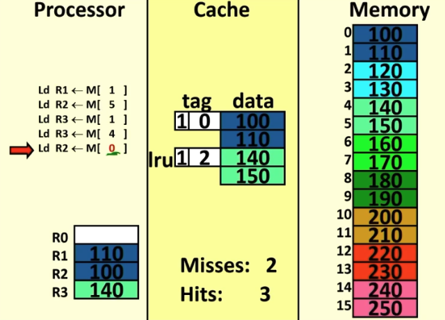

# Note Part 3: Cache and Memory Design

## Lec 16 - Cache

By complexity 左右两边是一样的. 但是考虑到实际的 cache，左边的代码远比右边快


目前我们 discuees 了两种 hold data 的 structures: reg file; memory

Reg file 和 memory 都是 array of words.

其中每个 word 都是一堆 32 个 bits(for LC2K, 64 for ARM) 组成. 

所以我们储存数据的最底层结构是：我们如何储存一个 bit?

根据之前学的，一个 bit 可以由一个 flip-flop 来表示

但是这显然不 practical 因为一个 flip-flop 里面的 transistor 太多了，而我们需要 2^18/32/64 个这样的单位.


### Options to represent a bit

reg files，数量极少（就几十个 regs）

由最贵最大的 D flip-flops 组成. 

其他的 memory: 有下面几个由快到慢的 options


#### Option 1: SRAM(Static Ramdom Access Memory)

用 SRAM 来表示的一个 bit 由 6 个 transistors 组成

它的优点是很快：1 ns read time，只慢于 flip flop.

虽然显著比 D flip-flop 小，但它仍然很大. 我们可以在一个 chip 上放 ~MB 个这样的东西；但是 ~GB 级别的 memory array 不可以用它表示

当然它需要 constant power 来 keep data.


主要用于：caches.


#### Option 2: DARM(Dynamic Ramdom Access Memory)

用 DRAM 来表示的一个 bit 由 1 个 transistor 和 1 个 capacitor (电容器) 组成

transistor 负责电荷进出，capacitor 负责储存电荷.

capacitor 的电荷会随着时间逐渐流失，因而需要周期性刷新来保持电荷. 所以它也是需要通电才能储存，断电后数据会流失.


慢于 SRAM. 50 ns read time (因为它使用了 capcacitor，refill 需要时间. 不像 SRAM 是纯粹靠 transistor 来维持 0/1 的. )


比 SRAM 更便宜. (transistor 是耗费大头，这里只有一个 transistor)

可以在 current machine 上放 ~16-64 GB 个.

对于 32 bit systems 是好的选择，但是对于 64 bit systems 则不是.

主要用于：main memory 以及显存等


#### Option 3: Disks

Disks，古早的是机械硬盘，使用 megnetic charges 来储存数据. 它的储存介质是通过 spinning disks 来完成.

##### HDD(Hard Disk Drive)

disk 的盘片表面有磁性材料，通过磁性的改变来表示 0/1

读写磁头由机械臂控制（所以叫机械硬盘），通过移动它到盘片的不同位置来进行数据读写.

disk 上有spinning 的电机，带动磁盘高速旋转，使得磁头可以快速定位到需要的数据上（这个"快速"相对于 DRAM 是非常非常非常非常慢的

速度：3000000 ns access time. 慢.


##### SSD(Solid State Drive)

固态硬盘. 无机械部件. 通过 NAND 闪存来存储数据.

机制比较复杂。使用浮动栅极晶体管，能够锁定电荷，用电荷是否存在表示 0/1.

寿命也有限。所以硬盘老了得换。

现在应该没人用机械硬盘了. SSD 的储存范围更大，可以 scale up to terabytes，单个 MB 的价格只需要 0.0001 刀.

SSD 的速度比 HDD 快很多. 但是仍然远远慢于 DRAM.


### Memory Hierarchy

我们想要一个尽量 fast (Ideally run at processor clock speed) 且 less expensive 的 memory system.

DRAM 和 Disks 太慢，SRAM 太贵/大.

所以我们需要 memory hierarchy.

Idea: 对于 main memory，介于大小的需求(GB级别)，我们只能使用 DRAM.  但是，**我们实际上在一段时间内只需要 access a small amount of data** 而不是整个 memory.

所以：我们可以用 a small array of SRAM to hold data we need now. 这个 small array of SRAM 就叫做 cache (缓存).


所以最后我们的 hirarchy 是：

regfiles: D flip-flop

~Kb 的 cache, 由 SRAM 组成

~Gb 的 memory, 由 DRAM 组成

Everything else, stored on disk (现在有 Virtual memory，允许计算机使用 disk 作为扩展内存，以在 RAM 不足时提供更大的可用内存空间。VM 的主要目的是让程序认为自己有足够的连续内存，即使实际的物理内存可能不够，从而增强系统的多任务处理能力和程序运行的稳定性。)


一个 analogy: memory, cache, reg


### Function of the Cache

我们使用 cache 来把 memory 中常用的数据放进其中，这部分数据之后在 cache 里和 pipeline processor 之间进行交互，而不是在 memory 里和 pipeline processor 之间进行交互，大大提高了速度。

实际上 Cache 也分为 L1, L2, L3 级别，和 cpu core 距离由近到远，大小由小到大，速度由快到慢。越常用的数据和指令放在越靠前的 cache.


Cache holds the data we think is most likely to be referenced.

我们首先考虑 LC2K 中最简单的 cache: 只用于 load instructions 的 cache: 

这个 cache 是一个 word addressable address space. 

当我们 lw 时，memory 会 return 一个 data。我们

1. 把 memory return 的 data 存进 cache，
2. 同时 together with 一个 tag: 储存这个 data 在 memory 中的地址，以便下次查找
3. 同时 together with 一个 one bit status: 表示这个data 是否 valid.

由这几个东西构成一个 word. 作为 cache 中一个位置上的 word.


### temporal locality

我们在 cache 中储存的时候需要考虑这些问题

1. cache 是否足够大，以每次遇到需要储存的东西都能够有空储存？
2. 如何选择 what to keep in cache?

我们有一个 locality 的原则：程序具有 temporal locality 和 spatial locality


**temporal locality 即：如果一个 given memory location is referenced now, it will probably be used again in the near future.**

（显然的，因为我们写代码肯定会用一个 variable multiple times）

并且由此可 corollary：如果我们很长时间不用一个 variable 了，说明它很可能任务完成了（之后不会再出现


cache 可以利用这个特性 ：

1. 对于 just accessed 的 data 应该 place into cache
2. 当我们必须要 evict something 的时候，我们 evict whatever data was **Least Recently Used(LRU)**


### example

Example: 我们采用一个简化的模型. 这里 Cache 的容量一共就 2 entries，每个 line 由 1 bit status,  4 bit tag, 8 bit data 组成（没有 LRU bit，因为一共只有两个 entries，一个被访问了之后另外一个就是 LRU data)

这里的 memory 是一个 bit addressable space, 一共有 16 lines, 

地址是 0b0000 - 0b1111

最大是 4 位，所以我们直接采用 tag = address，使用 4 位的 tag 来标记

#### Cache overhead

overhead 指的是 cache 中 non-data 的部分

这里，我的 data 一共 2*8 bits =16 bits 16 bits 

而 overhead: 

1. tag 2 * 4 bits
2. valid bits 2*1

一共 10 bits 的 overhead


每当 lw 时，我们首先遍历 cache，找不到的话：

1. 记录一个 Cache miss；
2. 在 memory 找，并且把找到的数据的 位置作为 tag，内容作为 data 放进 Cache 的 LRU 的地方，Status 设置为 1
3. 从 Cache 中数据进入 reg.


遍历这块 Cache，找到的话：

1. 记录一个 Cache hit
2. 直接从 Cache 里把数据导进 reg


#### 如果 Cache filled

当 Cache 被填满的时候，我们如果遇到一个新的 Cache miss，意味着又要放数据进来。我们只能 kick out 一个相对 LRU 的数据


这一块的逻辑应该是：这里的模型过于简单，实际上 status bit 会不止一个，最后从头到尾遍历比较 status bits 来找出最 LRU 的数据

这一部分在 next lecture


### Hit/Miss rate

HIt 指 data for a memory access 在 cache 中被找到

Miss 指 data for a memory access 在 cache 中没被找到

我们想要一个比较高的 Hit/Miss rate 


Ex: 

假设 Cache 的 access time 是 1 cycle

Main Memory 的 access time 是 100 cycles.

如果我们有 90% 的 Hit/Miss rate，那么 average memory latency 是多少？

$1*0.9 + (1+100)*0.1 = 11.0$


使用公式：

average latency = cache latency  + memory latency * miss rate

$1 + 100*0.1 = 11.0$


因而要优化 average latency，我们可以选择

1. 优化 memory latency
2. 优化 cache latency
3. 降低 miss rate


## Lec 17 - Improving Caches     

原本的 cache 模型：4 个 tag bit，直接使用地址作为 tag

问题：一共只容纳了两个数据，太容易 miss 了。例如：一个循环，里面有两个 local variable，于是每个 iteraion 之后，iterator 变量就被 cache 挤出去了。所以这个 cache 基本等于没有。实际上一个循环，local variable 有两个是很正常的。只能说明这个 cache 太弱了。


我们想要在能够寻址整个 memory 的同时，还能够尽量地多存储一些数据放进 cache 里。

办法：我们直接把 cache 做得更大点，容纳更多的数据。就这么简单，硬件szyd。


但是我们发现，cache overhead 是一个很 under optimized 的东西：

我们之前的简单 Memory，一共只有 16 格，地址有 4 bits. overhead 比数据本身要小。

但是 what about 2^32, 2^64 个位置的 memory？我们如果延续使用把整个地址作为 tag 的策略，那么对于正常的有 2^32, 2^64 个位置的 memory 而言，有 32 位/ 64 位的 memory address，以 32 bit address 为例，每一条 overhead 里就至少有 32 位的 tag.

再加上之后会有的 valid bit, dirty bit 以及 LRU bit 等等，overhead 会达到 40 bits 左右

而每一条的数据只有 1 byte = 8 bit. 因为这是 byte addressable 的.

这就导致了一条数据的 overhead 大小是数据本身的 5 倍. 于是整个 cache 就会非常臃肿。


优化 cache 就是优化它的 overhead. 我们需要想办法减小 overhead.


### Reducing overhead

优化 overhead，对于我们目前的 (fully associative) cache，就是优化 tag 的大小. 


我们目前的 tag 就是一个 address. 

Idea: 

对于一个完整的 address ，把前面几位作为 tag，一个 tag 对应多个数据，形成一个 block.

**比如我们在 4-bit address 中，把前三位作为 tag**

**于是 0000, 0001 都对应了 000 这个 tag. 一个 block 的 block size 变为 2 bytes：即，每次我们都把两个 bytes 的数据放进 cache** 


我们自然得到计算一个数据的 tag 是多少的方法：
$$
tag(x) = \lfloor \frac{addr(x)}{\text{block size}} \rfloor
$$
比如数据在第 11 位，block size 是 2，于是 tag 是 5

对于一个 address，我们称它后面 tag 外的位数为 **block offset.**

比如 11 = 0b1011

101 位 tag，最后一个 1 为 block offset


### Spatial Locality

试想我们使用这个策略，用 3 bits 的 tag 来寻址 4-bit 的 address，每次都 grab 1 bit 宽度内的所有数据，也就是这里的两条数据（2 bytes）

这个策略的意义其实比单纯的减小 cache 的 overhead 更多。因为它还很好地 **利用了spatial locality：因为我们每次 grab 的一个 block 中的数据都是连在一起的，通常程序中，连在一起的数据常常会先后紧接着被用到。比如数组的第一个元素和第二个元素。**


这里举一个例子：这段 machine code




我们 load 了 m[1], m[5] 之后又 load 了 m[4], m[0]：而 m[0], m[4] 已经在我们 grab m[1], m[5] 时连带着 grab 过了！

提高了 hit/miss rate. 


Other examples： 如果使用 2 bit tag：2 bit block offset，4 bytes block


### LRU with more than two entries

目前为止我们的 cache 一共只有两个 entries，所以每次 access 其中一个，LRU 就是另外一个。

但实际的 cache 的 entries 数量远多于两个。所以我们需要给每个 entry 添加 LRU bits 来判断哪个 entry 是 LRU entry.

**一共有多少个 entry，LRU bits 的表示范围就要是多少。有 N 个 entries，那么 LRU bits 需要能够表示 0~N 的数字。于是就需要** 

**$\lceil log_2(N) \rceil$ 个 LRU bits**

比如：如果 cache 一共有 4 个 entries，就需要 $log_2(4) =2 $ 个 LRU bits！


**LRU bits 的值从 0 到 N-1，0 表示这个entry 是 LRU 的，N-1 表示它是最 most recently used 的.**

LRU bits 的更新算法如下：

1. 一开始，entry 0, 1, 2, ..., N-1 的 LRU bits 分别赋予 0, 1, 2, ..., N-1 的值（这样一来，在 cache 第一次填满之前，被 grab 的 blocks 是从前到后放进去的）
2. 每当一个 element X 被使用：给它赋予 N-1的 LRU bits 值，代表它是 most recently used 的
3. 同时，遍历所有 entries，**对于所有 recent 值比先前的 X 高的 entries，把它们的 LRU bits 值 --**， 这样就保持了整个 cache 里始终只有一个 entry 的 LRU 值是 N-1.

```c
// when element i is used
X = counter[i] 	// first record the LRU value for comparason
counter[i] = N-1	// update LRU value of ele i as most recent
for (j=1; j<N; j++) {
  if(j!=i && counter[j]>X) counter[j]--;
}
```

ex:


#### Iteration is not actually costly

**Note：这里看似我们需要遍历所有 cache entries，要花很多时间，但是其实不用。**

**因为这是硬件。直接用 combinatorial logic，用 mux 一步解决就可以。所有判断都是 Parallel 的**

**整个 cache 也是：看起来我们要搜索一个 entry 要花费时间，但是其实不花费时间，都是并行的搜索。不像是写程序是一个一个遍历要花 O(N) time. 所以这里的这个类比程序其实不完全是对应的。**


### store: write back/through

我们之前都只考虑了 load word，但是和 memory 的交互还有 save word 这个行为

当我们 store 一个 result 进入 memory 时，由于 cache 的存在，我们肯定要同步把 result 写进 cache 里。

但是我们还要考虑这一问题：

1. 如果它在 cache 中，我们是否同步地把它写进 cache 和 memory 里（write-through policy）；

   还是只写进 cache，等到这个数据作为 LRU 被踢出来之后再放进 memory 里（**write-back policy**）？

2. 如果它不在 cache 里，我们是否要把它放进 cache（**allocate-on-write policy**）；

   还是不这么做？（no allocate-on-write policy）


现在我们把 write word 也计入 hit/miss 里。allocate-on-write 即：在 cache 里找要 store 的数据的位置是否有，如果没有则是一个 miss，那么我们在 memory 里重新查询后，再把它放进 cache. 


allocate-on-write 的性能优点是利用了 temporal locality：通常，刚刚 store 的 memory 不久之后也会用到。

而 write-back policy，看起来也比 write through 要更加 efficient 一点（未必，见下面分析），**需要增加一个 bit 的 overhead：添加一个 dirty bit**


#### write-through policy 

一个 write-through + allocate-on-write 的例子

1. load 了两个，miss

2. stote 找 M[0]: 0 = 0b0000，tag = 000, offset = 0，在 cache 中找到了 tag 000，并 +0 获得了 data，把 R2 值传给它，并传给 memory.

   Hit++


3. Store 找 M[5]: 5 = 0b0101，tag = 010，offset = 1，没有找到 tag，于是前往 memory 找，找到了之后首先改变 memory 中的值，然后把整个改完之后的 M[4], M[5] 作为 block 传给了 cache

   Miss++


总计 memory references：每次 miss 都往 memory 读两个 bytes；每次 write 都往 memory 写一个 byte

2x4 + 1x2 = 10 bytes


#### write-back policy

设置一个 dirty bit. 

每次当一个 cache line 从 memory 被 allocate 进来的时候，就 reset 为 0；

每当这个 cache line 被 reg store 进值的时候，我们更新 dirty bit 为 1，表示：它被写入了数据，但是数据并没有传回 memory，所以这个 cache line 已经不是进来的时候的数据了，是 "dirty" 的；

当一个 cache line 作为 LRU 被 evict 的时候，我们检查它的 dirty bit：如果 dirty bit = 0，表示这个过程中我们没修改过它的值，可以放心直接把它踢掉；如果 dirty bit = 1，表示我们修改过它的值了，还要把它 send back 回 memory.


write-back + allocate-on-write 的例子:

当 wrtie 数据进入 cache 时，我们不 send 它 back to mem 而是更新 dirty bit. 在它被 evict 的时候 send 一整个 block back to mem.


#### 性能对比

总计 memory references：每次 miss 都往 memory 读两个 bytes；**每次 evict 一个 dirty line，都往 memory 写一个 block：这里是两个 bytes.**

2x4 + 2x2 = 12 bytes

对比刚才的 write through policy 只交互了 10 bytes. 

**这个例子里我，write-back 的 memory reference 的总 bits 比 write-through 多，所以 write-through 在这里反而更加 efficient！**这是因为 write through 的每次交互都只是一个 bit，而 write back 则是一整个 block，因为 dirty bit 是一整个 block 的.


**所以我们需要权衡考虑性能：write-back policy 适合当我们需要在短时间内对一个 particular address 多次写数据的场景。**


## Lec 18 - Direct-mapped cache

我们目前为止搭建的 cache 都是 **fully-associatie cache：**任意 block in memory 都可以 go to cache 的任何位置

因为我们的实现方式是把 address 完整地分为 tag 和 offset. 这使得我们的寻址行为可以在整个 memory 中进行。


代价是：在比较大的地址空间里，要么 overhead 过长，要么 block 太大导致 copy 的成本太大。

比如 32 位地址空间，我们不得不把地址二分为 tag 和 offset

如果我们使用 22 位的 tag，那么我们的 offset 大小就是 10 位，也就是说：一个 block 里面包含了 2^10 =1,024 个 bytes 的 data，把这些 data copy 过来的代价太大了


### map a mem block to a cache line

现在考虑一种新的策略：

**direct-mapped cache，每个 block in memory 只能去 cache 里面固定的一行.**

也就是说，这个 map 是一个从 memory 到 cache 的函数. 一个 mem block 被 map 到一个 cache line，属于这个 line 的 addressable space.


Idea: 

1. **对于 N 行的 cache，我们把 memory 跳着划分成 N 份：**
2. **cache 的 lines 为 0, 1, ..., N-1；**
3. **对于 memory，上一个 block 划分进 line n 的 addressable space，下一个 就划分进 line $n+1 \mod N$  的 addressable space.**


### 划分一个 address 

而具体的做法是：我们把一个 address 分为 tag, line index 和 block offset 三个部分

line index 不需要称为 overhead，只要在 cache grab from memory 的时候 grab 特定的 memory blocks 就可以了

line bits 的数量就是 $\log_2(\lceil \text{cache lines} \rceil)$


ex：

**m[12]，12 = 0b1100，其 tag 为 1，line index 为 0b10 = 2，block offset 为 0**

**所以 12 属于 cache 的 line 2 的 addressable space，只能 go to cache line 2；而它在 cache line 2 中的 tag 为 1，因为 tag 0 的 block 是 m[4], m[5]；而它在自己的 block 中的位置是 0.**


example:

cache 有两行，于是 line bits = 1.

所以还剩下 3 bits 分给 tag & offset

既然 block size 为 2：offset bit = $\log_2(2) = 1$

所以 tag bits = 3-1 = 2，每个 cache line 对应了 memory 中的四个 block.


1. load from M[1]，1 = 0b0001，line 为 0，tag = 0b00 = 0，查看 line 0 并没有发现这个 tag，于是 grab from M[0:1]，放进 cache[0] 里.


2. Load from M[5]，5 = 0b0101，line 为 0，tag 为 0b01 = 1，查看 cache[0] 发现 tag 为 0 而不是 1，于是 grab from M[4:5]，放进 cache[0] 里.


### Note: direct-mapped cache 不需要 LRU bits

因为一个数据只对应一个 cache line！读到需要查看的 address 时，到它对应的 cache line 查看，tag 对就 hit，tag 不对就立刻替换.


direct-mapped cache 的优势是对于大的 address space 处理得更好，但是缺点是比起 fully-associative cache 显然更容易发生 conflicts.

不过，direct-mapped cache 很好地利用了 spatial locality. 虽然看起来它很容易 miss，但是同一块连续的 memory blocks 可以完全不冲突地放入 direct-mapped cache 中。这是因为连续的 blocks mapped to 的 cache line 不同，正好能够被整个 cache 容纳

stack frame 的 growth 就是连续的，所以这很符合实际的程序设计需求。


## Lec 19 - Set-Associative cache

Fully associative: any block can go to any cache line

Direct mapped: divide memory into regions, **map a region to a cache line**

set associative: divide memory into (fewer) regions, **map a region to a set of cache lines**


set associative 是 介于 fully associative 和 directed mapped 之间的 cache design，或者说 ：

fully associative，directed mapped 都是特殊的 set associative cache.

1. **fully associative 是整个 cache 都是同一个 set，整个 memory 都是同一个 region 的 set-associative cache**

2. **directed mapped 是每个 cache line 都是一个 set （one way），整个 memory alternating region 的 cache**


fully associative cache gives **best hit rate**，但是对于大的 address space 而言，需要的 entries 过于多，以至于速度慢下来。

Direct-mapped cache 更能处理大的 address space，但是 hit rate 降低。

而我们可以选择合适的 set 大小，建立 set associative cache，效果介于 fully associative 和 Direct-mapped 之间


一个 n-way set associative cache 的意思是：同一个 set 里有 n 个 entries. 

一个 set 就相当于一个 fully-associative cache.

计算一个 n-way 的 fully-associative cache 有几个 set: $\text{num of set} = \frac{\text{num of entries}}{n}$


### How set associative cache divide address space

一个有 m 个 sets 的 set associative cache 把 address space 分成 m 份

和 direct-mapped cache 一样，我们把一个 address 分成三个部分：

1. Tag bits
2. set bits (line bits in direct-mapped，因为 direct-mapped 中一个 line 就是一个 set！)
3. block offset


block offset bits = $log_2(block size)$

set bits = $log_2(sets)$

tag bits: the rest


比如这里：我们一共有两个 set，于是有$log_2(2) = 1$ 个 set bit

block offset bits = $log_2(2) = 1$

所以有 2 个 tag bits


### example


1. load M[1]，1 = 0b0001，set 0，tag 0，offset 1

   于是前往 set 0 寻找，并没有发现 tag 0

   于是前往 memory 中 grab set 0 的 region 中的第 0 个 block.

   


2. Load M[5]，5 = 0b0101，set 0，tag 1，offset 1

   于是前往 set 0 寻找没有发现 tag 1

   于是前往 memory 中 grab set 0 的 region 中的第 1 个 block.


3. Store 到 M[7]，7 = 0b0111，set 1，tag 1，offset 1

   前往 set 1没发现 tag 1，于是前往 memory 中 grab set 1 的 region 中的第 1 个 block，放进 cache

   并且注意：**这是个 store！于是我们在 cache 里修改这个 block 的 offset 1 的元素，并设置 dirty bit 为 1，以标记把它 evict 的时候要修改 memory.**


#### Practice problem

Byte addressable 的空间

32 bit address（note：我总是搞混的概念，，， 32bit 指的是一共有 2^32 次方个 address. 每个 address 都是一个 Byte，0000 0000 0000 0000 0000 0000 0000 0001 代表位置 1 上的这个 Byte，0000 0000 0000 0000 0000 0000 0000 0011 表示位置 2 上的这个 Byte，不是一个 address 上的东西的大小.）

64 = 2^6 B  blocksize

16KB = 2^(4+10) = 2^14 B cache

因而 cache 里一共有  2^14-6^  =  2^8^ blocks，每个 block 有 16 行


blockoffset: log_2 64 = 6 bits

在所有的 cache 设计里，blockoffset 都是一样的，只取决于 block 大小. 表示一个当前的 address 是它所在 block 的第几个地址，因而 blockoffset 的 bit 数即用多少个 bit 的二进制数可以表示一个 Block 中能容纳的地址数量

32 位 address 分为 tag, set index, offset，即 tag 


The breakdown of the address:

1. fully associative：

   set index: 0 bit

   tag: 26 bit

   

2. 4-way set asso cache：

   set index: 2 bit

   4-way：一个 Set 里面有 4 = 2^2^ 个 block！因而一共有 2^8-2^ 个 sets，也就是 2^6^ 个，需要用 6 bit表示

   因而 set: 6 bitshttps://drive.google.com/drive/my-drive

   因而 tag: 20 bits

   

3. direct-mapped cache：

   一个 block 就是一个 Set.

   一共有 2^8^ 个 Sets，也就是说 8 bits 的 set index

   tag 有 32-6-8= 18 bits


### More Sophiscated：Ln Cache, I/DCache

cache 变大的代价就是变慢

我们希望 cache 在足够大和足够快之间有一个平衡。

因而实践中我们设计多个 caches，让紧急的 data 放在最近的 L1 cache，使用比较少的 data 放在 L2, L3 cache


要把 cache 的设计放进我们的 Pipeline processor，我们需要把 Instruction 也拿出一个 cache 来放。

否则，instructions 是从 memory 里取的，而 data 则由于有 lw, sw 可以和 cache 有交互，因而 cycle 时间不平衡

对应的方案是：我们分 ICache 放 instructions，DCache 放 Data

（具体：如果其中一个 Miss 了怎么办？如果两个都 miss 了怎么办？我们在这节课先不考虑

## Lec 20 - Classifying Cache Miss


我们应该如何设计 cache 的大小和 associativity 等属性，从而改进一个 cache？要改进一个 cache 就是改进它的 miss rate。

因而我们首先要对 miss 进行分类


### 3 reasons for cache misses

1. compulsory miss：never accessed this data before
2. capacity miss：由于 cache 不够大导致的
3. conflict miss：由于 restrictive associativity 导致的；cache 足够大但是一个 set 太小，导致了 conflict


capacity miss 和 conflict miss 之间的界限比较模糊。

我们这样定义：

1. 如果 cache 比 memory 还大（或者说无限大）的情况下一个 miss 仍然会发生，就是 compulsory
2. 如果改用 fully associative cache 就不会发生这个 Miss，就是 conflict；
3. 否则就是 capacity


#### Practice problem

假设我们有 64B cache，16B blocks，2way，2sets

（两个 blocks 在 set1，两个 blocks 在 Set2；每个 block 16 行）

note：由于一个 block 16 行，我们可以用 hex 数来表示 address，这样的话第2 位 hex 不一样就说明不在一个 block 里）

由于有两个 set，hex 地址第二位是 even number 则在 Set 0，第二位是 odd numer 则在 Set 1


(note：set asso 的 hit，full asso 也可能会 miss！)

### 减少 Miss 的 3 个对应方法

减少 compulsory miss：增加 block size，单次 grab 的时候连带 grab 更多 blocks

缺点：given cache size，增加 Block size 会减少 block numbers 从而减少灵活度


减少 capacity miss：bigger cache

缺点：会增加 latency


减少 conflict miss：更大的 associativity

缺点：会增加 latency 以及 Overhead（因为 ways 数量每翻倍，set 的数量都减半，block offset 不变，set bits 减少一个，tag 的 bits 数就增加一个

tag bits 的增加就增加了 overhead，并且检索量翻了一倍，增加了 latency


#### Cache size 的影响

Cache size 的增加会增加 latency，也会增加 Hit rate

太小的 cache size 的 hit rate 太低，会经常要更改 cache line，导致利用不好 temporal locality

所以会呈边际递减。cache size 应该有一定大，但是不能过大，否则 miss latency 的增加就会超过 Hit rate 的增加带来的时间消耗的减少


#### Block size 的影响

block size 代表对 spatial locality 的假定程度

太小的 block 会利用不好 spatial locality，并且也会增加 tag overhead（block offset 减小，tag bits 增加

小大的 block，在给定 cache 大小下，会减少 blocks 的总数量；首先，大 block 会增加 data transfer 一次的数量；其次，blocks 总数量的减少，对于多个比较远的 memory 位置上的频繁交替调用（比如函数调用），会导致频繁的 data transfer，增加了 Miss rate


#### Associaticity 的影响：

associatity：多少个 Blocks 可以 map 到同一个 set？

更大的 associativity 会减少 miss rate，会降低在不同 programs 中切换的 variation

更小的 associativity，虽然 miss rate 会增加，但是 hit time 会减少：每次只需要搜寻更小的 space，只在一个set 中就可以了


### Practice problems

Pipeling with cache：

remember that ：

CPI = 1 + stall possibility * stall cycles

一个 Clock cycle 如果 500Mhz: 2ns cycle time

如果 cache miss 有 100 ns latency：等于 50 cycles


判断 block size，associativity 以及集合数：

block size 是最先看出的。并且一定是在最前面几行看出，因为后面的 Miss 可能有 associativity 的缘故，前面一定因为 Block size

我们通过相近的 miss 来判断 block size 的上界，相近的 hit 来判断下界

remember：必须是 2 的倍数


associativity 其次看出。有一定难度

N-way：一个 set 里面有 N 个 Blocks，容量是 N

**direct map 首先要经历排除：direct map就是1 way，那么 cache 中一个 block 对应一个 set。**

**因而，一个 address 过了 cache size 个 addresses 之后遇到和它相同 set 的 index**

比如 cache size 512B，那么 0x310在过了 512B，也就是 2 * 16^2，到了 0x510 之后才是同一个 index

如果同一个 index 上的元素连续 hit，那么就说明 #way > 1!

其次，我们可以 Bound 住 #ways. 通过观察，同一个 Block 的元素，在 Hit 之后经历了多少个其他操作被踢了出来。它被放进去的时候是 LRU 值最高的，如果经历了两个指令就被提出来了（同 block 的元素 miss 了）那么一定在这两个指令之间被替换了，所以 block size <= 2.


## Lec 21 - Virtual Memory

目前我们的讨论：假设所有 Programs 都对 memory 有 full, private access

但是实际上：多个 programs 同时运行。试想：两个 Program 可能同时都想 write to 同一个 memory address

并且，即便我们只有一个 Program 在运行。我们知道，既然我们的地址有 64 位，寻址空间有 2^64 个 bytes，我们可以搜寻其中任何一个 Byte 的地址。也就是说，一共有 2^24 TB 的储存单位在 memory 里？我们理应可以输入 2^64 个地址中的任何一个


这显然是不可能的。实际上 modern system 对这两个问题给出了同一个答案，也就是 virtual memory：

每个 program 都假定它有 full private access to memory，也就是能够寻址 0x0 to 0xFFFF....FFFF

而我们的 hardware 和操作系统的 software 把这些虚拟地址 map 到 DRAM 以及 hard disk 上的具体的不同位置

所谓 virtual 就是使用 a level of indirection


Address translation 的工作在 software 端由一系列合称为 operating system 的 programs 来管理，它们**直接管理 hardware resources for all other running programs！**

operating system 实现 address translation 是依靠一种叫做 **page table** 的 data structure.


### Pages

Memory 被划分为 fixed-size chunks 称为 pages（4KB for x86

一个 virtual page 的大小和 physical page 的大小相同

一个 virtual adress 被分为 page number 和 page offset 两部分，就像是 cache 中一个地址被分为 tag 和 block offset 一样


这样之后，翻译一个 virtual address into physical address 实际上就是把 virtual page number 映射到 physical page number（like hash，modular operation，由于 Physical page number 有限，virtual page number 比较多，这不是一个 injective map


pages 的 boundary 上，相邻的 virtual address 可能会被 map 到 physical 距离很远的不同 pages 里，但是在同一个 page 里，contiguous 的 address 仍然保持 contiguous


Question：why pages？为什么不直接 map 一个  virtual address to 一个 physical address 呢?

Answer：This is actually just talking about page 的大小. 这个 Idea 等于 Have 1B page.

pages 越小，那么数量范围就越大。

比如 2^64 B 的 virtual memory，一个 page 4KB = 2^12 B，如果是 single level page table（之后我们会知道不可行，要使用 multi level 才实际），那么 pages 的范围是 0-2^52，所以 page table 有 2^52 这么大！memory 里根本放不下。如果一个 page 1B，那么 page table 的大小是 2^64，更加不可能

并且，我们的 Page 大小也要足够，以运用 spatial locality of a program. 否则跨 page 找 data 的 cost 会很大


### Page Table

刚才说到，翻译一个 virtual address into physical address 实际上就是把 virtual page number 映射到 physical page number，which is not injective；具体实现这种映射的方法是 page table

一个 page table 就是 virtual page # 到 physical page # 的映射规则

每个 running process 都有自己的 own page table，maintained by OS


page table 自身在 memory 中，OS 知道 page tables 的位置（所以我们假设 OS 运行正常，不用管怎么 access page table）


Page table 就长这样：

第 n 行表示第 n 个 virtual page，这行的 entry 是一个 valid bit 加上 n 对应的 physical page num

我们有一个专门的 **page table reg** 指向 Page tables 的 beginning；可想而知，我们执行程序的时候，一个 process 有一个自己的 page table，因而 page table reg 会不停地切换多个 Process 的 page table 的 beginning！

（recall：同一个 processor 的同一个 kernel 可以管理多个 process，这是通过 OS 把时间分为小的 slices，时间片用完后，操作系统会暂停当前进程，并切换到下一个进程，这种快速切换（通常以毫秒级或微秒级）给人的感觉是多个进程在“同时”运行）


ex:


4 KB page：2^12B，对应 12 bits 大小表示，也就是 3 hex

于是一个地址的后三个 hex 位是 offset，前面是 page num


### Extend VM to disk

Virtual memory 的目标：

1. Transparency：一个 Program 不用管其他 programs，可以调用整个 virtual memory；
2. protection：一个 program 不能 access 其他 programs 的 data
3. capacity：每个 program 都可以拥有比 DRAM size 更多的 data，意味着我们可以把 physical memory 扩充到 hard disk！


Transparency，protection 的实现就是保持 Physical pages 不冲突，两个 program 不能有 map 到同一个 physical table 的 virtual table 就可以

capacity 的实现就是：当 DRAM 用完的时候用 disk 作为 temporary space

可想而知这很慢。

所以这就解释了我们的电脑突然卡顿一下的原因：

如果我们的电脑持续稳定地卡，说明cpu不行；但是如果经常突然卡一会儿，说明 memory 太小，因为卡一会儿的原因是 processes 太多，共计 pages 已经占满了整个 memory，于是 extend VM 的 physical 映射目标 to disk，用 disk 来存新的 table，由于 disk 比内存慢几百倍，这个时候存取数据就会非常慢；关掉一点程序就好了


#### valid bit 的使用

并且：notice，如果真的在 disk 和 reg 之间交互会非常慢，我们尽量只交互一次。即：每当要处理 hard disk 上的 page，我们把一个 memory 里的 page 和 hard disk 里的 page 调换。

我们通过这种方式来告诉 hardware，这个 page 不在 memory 里而是在 disk 上：我们把 valid bit 设置为 0，并且后面跟上它 memory 里的位置

**valid bit 为 0 有两个情况：情况 1，这个 virtual page 并不对应任何 physical page，还没有被 assign。这个情况，valid bit = 0 并且后面跟着的 page num 也是 0，是空的**

**情况 2，这个 virtual page 对应的 physical page 在 disk 上。这个情况，valid bit = 0 并且后面跟着的 page num 不是 0，是具体的 disk 位置**

检测到 physical page 在 disk 上后，我们执行这个流程：

1. **Stop this process**: The current process is paused because it cannot proceed without the requested page.
2. **Pick page to replace**: The system selects a page in physical memory to be replaced (using a page replacement algorithm, e.g., LRU or FIFO).
3. **Write back data**: If the selected page is dirty (modified), its contents are written back to the disk.
4. **Get referenced page**: The required page is loaded from disk into physical memory.
5. **Update page table**: The page table entry is updated to reflect the new physical location of the page, and the valid bit is set to **1**.
6. **Reschedule process**: The process that caused the page fault is resumed.

通过这个流程，替换 disk 和 memory 上的一个 page。

和 cache 里，sw 的 write back 很像


## Lec 22 - Multi-Level VM


